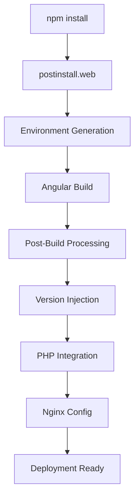

# Build Process Documentation

## Overview

This directory contains build tools and scripts for the Giddh Angular application, supporting both web and Electron builds with post-build processing, environment configuration, and deployment automation.

## Directory Structure

```text
tools/
├── web/
│   ├── postbuild.js          # Post-build processing for web deployment
│   └── postinstall.js        # Web environment setup
├── electron/
│   └── postinstall.js        # Electron environment setup
├── schematics/               # Angular schematics (empty)
└── tsconfig.tools.json       # TypeScript configuration for tools
```

## Web Build Tools

### Post-Build Processing (`web/postbuild.js`)

**Purpose**: Processes the built Angular application for production deployment with PHP integration and white-label support.

**Key Features**:
- Version and hash injection
- PHP script integration for white-label functionality
- Nginx configuration generation
- AWS EC2 metadata handling
- Index.html to index.php conversion

**Usage**:
```bash
# Called automatically during build process
node tools/web/postbuild --path=dist/apps/web-giddh

# Manual execution
node tools/web/postbuild.js --path=dist/apps/web-giddh
```

**Processing Steps**:

1. **Version Management**:
   ```javascript
   // Creates version.json with app version and bundle hash
   {"version": "9.1.0", "hash": "a1b2c3d4"}
   ```

2. **Hash Replacement**:
   ```javascript
   // Replaces placeholder in main bundle
   '{{POST_BUILD_ENTERS_HASH_HERE}}' → actual_bundle_hash
   ```

3. **PHP Integration**:
   ```php
   // Adds PHP script for white-label functionality
   <?php
   $targetUrl = getenv("GIDDH_WHITE_LABEL_URL");
   // ... white-label logic
   ?>
   ```

4. **File Transformation**:
   ```bash
   index.html → index.php  # For PHP processing
   ```

5. **Nginx Configuration**:
   ```nginx
   # Creates .platform/nginx/conf.d/elasticbeanstalk/php.conf
   location / {
       try_files ^ /index.php$is_args$args;
   }
   ```

### Web Post-Install (`web/postinstall.js`)

**Purpose**: Sets up the web development environment after npm install.

**Features**:
- Development environment validation
- Dependency checks
- Configuration setup

## Electron Build Tools

### Electron Post-Install (`electron/postinstall.js`)

**Purpose**: Configures the Electron build environment.

**Features**:
- Electron-specific dependency setup
- Native module compilation
- Platform-specific configurations

## Build Integration

### Package.json Integration

The tools are integrated into the build process through package.json scripts:

```json
{
  "scripts": {
    "postinstall.web": "node tools/web/postinstall",
    "postinstall.electron": "node tools/electron/postinstall",
    "build-prod": "npm run postinstall.web && ... && node tools/web/postbuild --path=dist/apps/web-giddh",
    "build-stage": "npm run postinstall.web && ... && node tools/web/postbuild --path=dist/apps/web-giddh",
    "build-test": "npm run postinstall.web && ... && node tools/web/postbuild --path=dist/apps/web-giddh"
  }
}
```

### Build Flow



## White-Label Functionality

### Environment Variables

The post-build script uses these environment variables for white-label support:

```bash
# Primary white-label URL
GIDDH_WHITE_LABEL_URL=https://api.example.com/whitelabel

# UK/GB specific white-label URL
GIDDH_GB_WHITE_LABEL_URL=https://gb-api.example.com/whitelabel
```

### Region Detection

```php
// Automatic region detection from query parameters
parse_str($parsedUrl['query'] ?? '', $queryParams);
if (!empty($queryParams['region']) && in_array(strtolower($queryParams['region']), ['uk', 'gb', 'UK', 'GB'])) {
    $targetUrl = getenv("GIDDH_GB_WHITE_LABEL_URL");
}
```

### Client-Side Integration

```javascript
// White-label data is stored in localStorage.
// json_encode emits a JS string literal (or null when curl failed).
// Never wrap the PHP output in quotes or use slice(1,-1) — that turns
// json_encode(false) ("false") into "als" and crashes JSON.parse on boot.
var response = <?php echo ($response === false || $response === null || $response === '') ? 'null' : json_encode($response); ?>;
if (typeof response === 'string' && response) {
    try {
        JSON.parse(response);
        localStorage.setItem('whiteLabel', response);
    } catch (e) {
        console.warn('Invalid whiteLabel response from server, skipping localStorage write', e);
    }
}
```

## AWS Integration

### EC2 Metadata Handling

The post-build script includes AWS EC2 metadata retrieval:

```php
// Token-based metadata access (IMDSv2)
$token = @file_get_contents(
    "http://169.254.169.254/latest/api/token",
    false,
    stream_context_create([
        'http' => [
            'method' => 'PUT',
            'header' => "X-aws-ec2-metadata-token-ttl-seconds: 21600"
        ]
    ])
);

// Instance metadata retrieval
$instanceInfo = @file_get_contents(
    "http://169.254.169.254/latest/dynamic/instance-identity/document",
    false,
    $ctx
);
```

### Caching Strategy

```php
// Metadata caching to reduce API calls
$cacheFile = __DIR__ . '/instance-metadata.json';
if (file_exists($cacheFile)) {
    $instanceInfo = file_get_contents($cacheFile);
}
```

## Deployment Configuration

### Nginx Configuration

The generated `php.conf` provides:

**Static Asset Handling**:
```nginx
location ~* \.(?:js|css|png|jpg|jpeg|gif|ico|woff|woff2|ttf|otf|eot|svg|mp4|webm|html|json|map|pdf|txt|br)$ {
    try_files $uri =404;
}
```

**Angular Route Handling**:
```nginx
location /assets/ {
    try_files $uri $uri/ =404;
}
```

**PHP Processing**:
```nginx
location / {
    try_files ^ /index.php$is_args$args;
}
```

### PHP-FPM Integration

```nginx
location ~ \.(php|phar)(/.*)?$ {
    fastcgi_split_path_info ^(.+\.(?:php|phar))(/.*)$;
    fastcgi_intercept_errors on;
    fastcgi_index  index.php;
    # ... FastCGI parameters
    fastcgi_pass   php-fpm;
}
```

## Error Handling

### Build Error Recovery

```javascript
// Graceful handling of missing files
if (!mainBundleFile) {
    console.warn('Main bundle file not found, skipping hash replacement.');
    return;
}
```

### Directory Creation

```javascript
// Ensures directories exist before file operations
const ensureDirectoriesExist = (filePath) => {
    const dirPath = path.dirname(filePath);
    return mkdir(dirPath, { recursive: true })
        .catch((err) => {
            if (err.code !== 'EEXIST') {
                console.error(`Error ensuring directories for ${dirPath}:`, err);
                throw err;
            }
        });
};
```

## Development Workflow

### Local Development

```bash
# Setup development environment
npm run postinstall.web

# Start development server
npm start
```

### Production Build

```bash
# Full production build with post-processing
npm run build-prod

# Staging build
npm run build-stage

# Test build
npm run build-test
```

### Electron Development

```bash
# Setup Electron environment
npm run postinstall.electron

# Build Electron application
npm run build.electron.giddh
```

## Troubleshooting

### Common Issues

#### 1. Post-Build Script Failures

**Error**: `Missing --path argument`
```bash
# Solution: Ensure path argument is provided
node tools/web/postbuild.js --path=dist/apps/web-giddh
```

#### 2. PHP Configuration Issues

**Error**: `FastCGI not working`
```bash
# Check nginx configuration
sudo nginx -t

# Verify PHP-FPM is running
sudo systemctl status php-fpm
```

#### 3. White-Label API Failures

**Error**: `White-label data not loading`
```bash
# Check environment variables
echo $GIDDH_WHITE_LABEL_URL
echo $GIDDH_GB_WHITE_LABEL_URL

# Verify API endpoints
curl -H "Origin: https://your-domain.com" $GIDDH_WHITE_LABEL_URL
```

#### 4. Bundle Hash Issues

**Error**: `Hash replacement failed`
```bash
# Check if main bundle exists
ls dist/apps/web-giddh/main*.js

# Verify placeholder exists in bundle
grep "{{POST_BUILD_ENTERS_HASH_HERE}}" dist/apps/web-giddh/main*.js
```

### Debug Commands

```bash
# Verbose post-build execution
DEBUG=* node tools/web/postbuild.js --path=dist/apps/web-giddh

# Check generated files
ls -la dist/apps/web-giddh/
cat dist/apps/web-giddh/version.json
cat dist/apps/web-giddh/.platform/nginx/conf.d/elasticbeanstalk/php.conf

# Test PHP functionality
php -l dist/apps/web-giddh/index.php
```

## Performance Optimization

### Build Performance

```javascript
// Parallel file operations where possible
Promise.all([
    writeFile(versionFilePath, versionContent),
    ensureDirectoriesExist(phpConfPath)
]).then(() => {
    // Continue with dependent operations
});
```

### Caching Strategy

```php
// Metadata caching reduces AWS API calls
if (file_exists($cacheFile)) {
    $instanceInfo = file_get_contents($cacheFile);
} else {
    // Fetch and cache metadata
    file_put_contents($cacheFile, $instanceInfo);
}
```

## Security Considerations

### Environment Variable Security

```bash
# Sensitive variables should be set at server level
export GIDDH_WHITE_LABEL_URL="https://secure-api.example.com"
export GIDDH_GB_WHITE_LABEL_URL="https://secure-gb-api.example.com"
```

### CORS Handling

```php
// Proper origin header for API requests
$headers = [
    "Origin: $baseUrl"
];
```

### Input Validation

```php
// Validate region parameters
if (!empty($queryParams['region']) && in_array(strtolower($queryParams['region']), ['uk', 'gb', 'UK', 'GB'])) {
    // Safe to use region parameter
}
```

## Monitoring and Logging

### Build Monitoring

```javascript
// Comprehensive logging throughout build process
console.log('Running post-build tasks');
console.log(`Writing version and hash to ${versionFilePath}`);
console.log('Post-build tasks completed successfully.');
```

### Error Tracking

```javascript
.catch(err => {
    console.error('Error during post-build tasks:', err);
    process.exit(1); // Fail the build on errors
});
```

## Integration with CI/CD

### Build Pipeline Integration

```yaml
# Example CI/CD integration
steps:
  - name: Install Dependencies
    run: npm install
    
  - name: Setup Web Environment
    run: npm run postinstall.web
    
  - name: Build Application
    run: npm run build-prod
    
  - name: Verify Build Output
    run: |
      test -f dist/apps/web-giddh/index.php
      test -f dist/apps/web-giddh/version.json
      test -f dist/apps/web-giddh/.platform/nginx/conf.d/elasticbeanstalk/php.conf
```

### Environment-Specific Builds

```bash
# Different builds for different environments
npm run build-prod   # Production with full optimization
npm run build-stage  # Staging with debugging enabled
npm run build-test   # Test environment with test APIs
```

## Future Enhancements

### Planned Improvements

1. **Enhanced Error Handling**: More granular error recovery
2. **Performance Metrics**: Build time and bundle size tracking
3. **Automated Testing**: Post-build validation scripts
4. **Docker Integration**: Containerized build processes

### Migration Considerations

- **PHP 8+ Compatibility**: Update PHP scripts for newer versions
- **Nginx Updates**: Keep nginx configuration current
- **AWS IMDSv2**: Already implemented for security compliance

---

**Build Tools Status**: ✅ **Production Ready**

These build tools provide comprehensive support for web and Electron deployments with advanced features like white-labeling, AWS integration, and automated post-processing.
